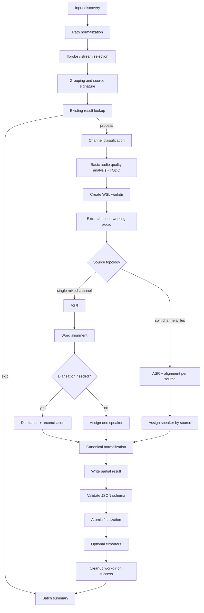

# Architecture

## 1. Architectural style

The application core is a domain library. The CLI, future GUI, and any future local service are adapters. Integrations with FFmpeg, WhisperX, pyannote, and the filesystem are infrastructure ports.

## 2. Processing pipeline



## 3. Recommended modules

```text
src/ewp-transcripts/
  domain/
    jobs
    sources
    speakers
    transcript
    warnings
    versions
  application/
    inspect_service
    dry_run_service
    transcribe_service
    export_service
    clean_service
    doctor_service
  ports/
    media_probe
    audio_decoder
    asr_backend
    alignment_backend
    diarization_backend
    result_repository
    workdir_repository
  adapters/
    ffmpeg
    whisperx
    pyannote
    filesystem
  exporters/
    txt
    srt
    vtt
    segments_json
  cli/
  config/
  schemas/
```

These names are recommendations, not a public API contract.

## 4. Domain models

### Source

Represents specific input content, not merely a path. Identity is based on SHA-256 plus selected stream and channel information.

### EpisodeJob

One processing unit: either a single file or a group of files sharing one timeline.

### Speaker

Contains a stable `speaker_id` and a display label. They are separate because a label may later be edited without changing references in words and segments.

### Word

The smallest timestamped unit. It records timestamp provenance and optional confidence.

### Segment

A chronologically coherent piece of speech. Canonical segments do not have to match subtitle cues.

### Warning

A structured diagnostic with a code, severity, source, and context.

## 5. Separation of transcription and export

ASR produces a rich canonical model. Exporters are deterministic transformations:

```text
results.json + export_config → TXT/SRT/VTT/segments.json
```

An exporter must not require source audio. This avoids repeated expensive processing and permits subtitle regeneration after cue settings change.

## 6. GPU memory management

The pipeline should load models by stage and release them between stages when required for stable operation. The MVP processes one GPU job at a time.

The JSON result records:

- model identifiers;
- compute type;
- batch size;
- device;
- peak VRAM when available;
- duration of each stage.

## 7. Responsibility boundaries

- FFmpeg handles probing, stream selection, decoding, and preparation of working audio.
- The channel classifier determines channel topology only; it does not identify people.
- WhisperX handles ASR and word alignment.
- pyannote handles diarization of mixed material.
- The normalizer translates backend output into the project's stable schema.
- Exporters do not depend on ML backends.
